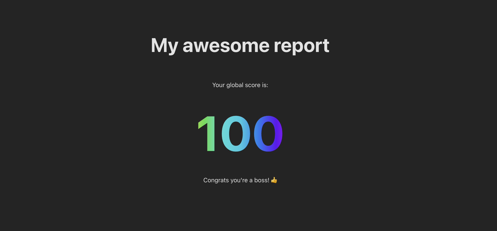

# TLDR

In this feature insight, we explain how we generate the new reporting feature from sls-mentor, getting inspiration from [jest-html-reporter](https://github.com/Hazyzh/jest-html-reporters). And we show you how to code your own report tool using react.

# Getting a fresh new report for sls-mentor ?

With my team we have been building [sls-mentor](https://www.sls-mentor.dev/), a **free and open source** tool to audit your serverless stack on AWSand to give you tips to improve it!

The tool runs in the cli and outputs the result directly in the terminal. We pimped the result, and it is already quite good-looking 😎.


But a cli print is not easy to share and the look still feels a bit rough! And as developers, we have to present technical concepts all the time, and we learned that the presentation is as important as the content. That's why we wanted a report that can be presented to our clients, our managers to convey the quality of our serverless infrastructures or the need for real work on it.

That's why we decided to add a reporting feature to sls-mentor.

# It does look better doesn't it ? 😍


The report is generated in the cli as a single html file. So you can share it and display it in any browser! Showing your audit results has never been so easy! 🚀

Moreover tips are displayed on the bottom to help you improve your stack, and they redirect to sls-mentor website to get more details. 🤓

# What's under the hood ? 🪛

The report is generated in React, it is a one of most popular and well known framework in web development so it is easy to customize and to add new features. we are already working on it! 💪

We actually got inspired by [jest-html-reporter](https://github.com/Hazyzh/jest-html-reporters) to generate the report.

First we write a template react app, and we build it into a single html file.

The template file contains a placeholder string, for example for jest-html-report, it is:

```javascript
module.exports = '<<<JEST-HTML-REPLACE-PLACEHOLDER>>>';
```

Then at runtime, jest copies the template file, then replaces the placeholder with the result of the analysis and 💥! It generates an html report!

Simple isn't it ? 😎

# Coding time 👨🏽‍💻! Let's write a report template

Ok, now we know the general idea, let's write our own report template.

## Create a react app

First, we need to create a react app, I used [vite](https://vitejs.dev/), but you can use [create-react-app](https://create-react-app.dev/) or any other tool.

`yarn create vite my-report-template`

Choose react, typescript, and no framework.

## Build the app as a single html file

Now you have a react app. Try to build it.

`yarn install && yarn build`

It generates a dist folder with an index.html file. But if you try to open it in your browser, you will see a blank page.

If you open the index.html in an editor, you will notice it just an empty div and some scripts to js files.

That's not what we want, we want a single html file that contains everything. So it is easy to share.

So we use this wonderful vite plugin: [vite-plugin-singlefile](https://github.com/richardtallent/vite-plugin-singlefile) 💪

`yarn add -D vite-plugin-singlefile`

Then we add it to vite.config.ts

```typescript
import { defineConfig } from 'vite';
import react from '@vitejs/plugin-react';
import { viteSingleFile } from 'vite-plugin-singlefile';

// https://vitejs.dev/config/
export default defineConfig({
  plugins: [react(), viteSingleFile()],
});
```

Now if you build again, you will have a single html file in the dist folder. 🎉

If you open it in your browser, you will see your app, except for a small detail: the images are not displayed! 😱 Because the images are absolute imports to other svg files in the dist folder. The issue is not problematic but a bit painful to fix: the svg must be converted into react components (which can be done using this great [tool](https://react-svgr.com/playground/)).

## Customize the report

Let's write a super simple report with just a score

```typescript
// App.tsx
import './App.css';
function App() {
  const score = 40;
  return (
    <>
      <div>
        <h1>My awesome report</h1>
        <p> Your global score is:</p>
        <p className="score">{score}</p>
        {score > 50 ? <p>Congrats you're a boss! 👍</p> : <p>Keep going! 🏃‍♂️</p>}
      </div>
    </>
  );
}

export default App;
```

```css
/* App.css */

#root {
  max-width: 1280px;
  margin: 0 auto;
  padding: 2rem;
  text-align: center;
}

h1 {
  font-size: 3rem;
  font-weight: bold;
  margin-bottom: 4rem;
}
.score {
  font-size: 8em;
  font-weight: bold;
  background-image: linear-gradient(
    90deg,
    rgba(255, 0, 0, 1) 0%,
    rgba(255, 154, 0, 1) 10%,
    rgba(208, 222, 33, 1) 20%,
    rgba(79, 220, 74, 1) 30%,
    rgba(63, 218, 216, 1) 40%,
    rgba(47, 201, 226, 1) 50%,
    rgba(28, 127, 238, 1) 60%,
    rgba(95, 21, 242, 1) 70%,
    rgba(186, 12, 248, 1) 80%,
    rgba(251, 7, 217, 1) 90%,
    rgba(255, 0, 0, 1) 100%
  );
  margin: auto;
  -webkit-text-fill-color: transparent;
  background-clip: text;
  -webkit-background-clip: text;
  color: transparent;
}
```

Well, it is not the most beautiful report, but it is a start. 🤷‍♂️


## Pass data to the report

Now we want to pass data to the report.

For sls-mentor, we used a [react context](https://react.dev/learn/passing-data-deeply-with-context) to pass the data to the report. But for the sake of simplicity, we will use here a simple variable.

```typescript
// replace App function with following code

function App() {
  // for development purposes, we want to have a default result
  let result: Result;
  try {
    result = JSON.parse('<<<RESULTS_PLACEHOLDER>>>') as Result;
  } catch (e) {
    result = { score: 40 };
  }

  return (
    <>
      <div>
        <h1>My awesome report</h1>
        <p> Your global score is:</p>
        <p className="score">{result.score}</p>
        {result.score > 50 ? <p>Congrats you're a boss! 👍</p> : <p>Keep going! 🏃‍♂️</p>}
      </div>
    </>
  );
}
```

The placeholder `<<<RESULTS_PLACEHOLDER>>>` will be replaced by the result of the analysis.

## Test the template manually

Now we have a template, we want to test it.

- First, let's build the report again and copy it to a new file report.html.
- Open the report.html in your editor, and search for `<<<RESULTS_PLACEHOLDER>>>`.
- Replace it with `{\"score\": 100}` (⚠️ don't forget to escape the quotes !).
- Save the file and open it in your browser.

**You should see the score 100!! 🎉.**



## Automate ! 🤖

In order to build the report from your cli, just automate the previous steps with a script:

- duplicate the template file to a new file report.html
- replace the placeholder with the result of the analysis and don't forget to escape the quotes

Here is an example of script with nodejs:

```typescript
import { readFileSync, writeFileSync } from 'node:fs';

const TEMPLATE_PATH = 'template/index.html';
const PLACEHOLDER = '<<<RESULTS_PLACEHOLDER>>>';
const REPORT_OUTPUT_PATH = 'public/report.html';
const auditResult = { score: 100 };

const data = JSON.stringify(auditResult).replace(/"/g, '\\"');

const template = readFileSync(TEMPLATE_PATH).toString();

const report = template.replace(PLACEHOLDER, data);

writeFileSync(REPORT_OUTPUT_PATH, report);
```

Now it's your time to shine ! 🌟

# Found a typo?

If you've found a typo, a sentence that could be improved or anything else that should be updated on this blog post, you can access it through a git repository and make a pull request. Instead of posting a comment, please go directly to https://github.com/QuentinNativel/articles and open a new pull request with your changes.
